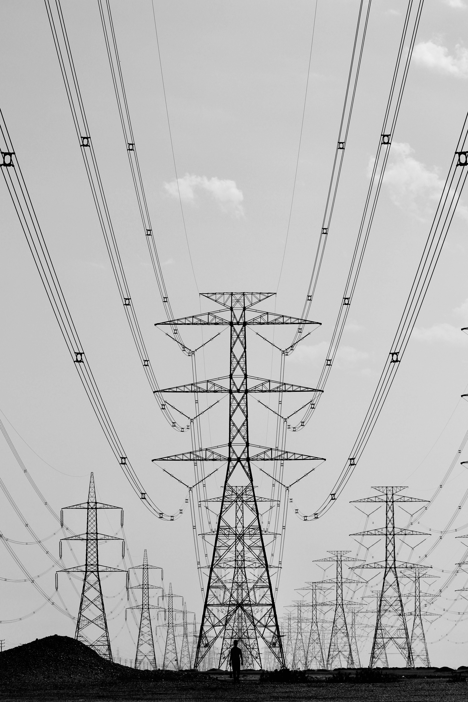

## Transmission line dynamics in inverter-dominated grids 

### Collaborators: Gabriel Colon-Reyes, Sunash Sharma

In a power grid with a growing penetration of renewable resources, inverters are playing a larger role in the dynamic behaviour of the grid. It is important to understand how the presence of these inverters affects grid stability. This has initiated a re-examination of long-established assumptions made when conducting power systems studies. In this work we study the  small-signal stability characteristics of a power system comprised of inverter and synchronous machine sources, and consider the effect of inverter control gains, transmission line dynamics, and network operating conditions. We utilize PowerSimulationsDynamics.jl to perform this study on the IEEE WSCC 9 Bus test system. We vary inverter parameters across reported ranges in the literature, we consider three transmission line models of varying fidelity, and compare results across different operating conditions. We find that line dynamics are generally important for correctly assessing small-signal stability in networks with large penetrations of grid-following converters, and that gain tuning in these networks should utilize high fidelity line models.

## Price responsive demand in 100% renewable grids 

### Collaborators: Eleanor Adachi, Eli Brock

Transitioning electricity grids to 100% variable renewable energy (VRE) raises concerns about price formation in energy markets if most generators have zero marginal costs, as well as about the profitability of remaining fossil fuel generators. In this paper, we investigate what happens to market clearing prices, electricity demand, and producer surplus during the transition to 100% VRE using a five-bus network with price-responsive demand and storage representing a miniature version of the California grid in the year 2040. We employ a quasi-constant elasticity demand curve to simulate demand-side bids and use the DC optimal power flow approximation to model how supply, demand, and storage would be dispatched in the wholesale market.  We find that with both price-responsive demand and storage, stable average prices can be maintained throughout the transition to 100% VRE. In addition, producer surplus per unit of installed capacity for dispatchable generators increases as the transition progresses.

## Effect of renewable plant outages on electricity prices and carbon intensity

### Supported by the [Energy & Environmental Economics Mentoring Program](https://www.olab.berkeley.edu/sloan-gradstudents-2024-25) 

Renewable power plants in operation today will form the backbone of our decarbonized energy system moving forward. These power plants have high upfront costs but are cheap to operate, making it valuable to extend their lifetime through intelligent maintenance strategies and management of downtime. Currently, most reported outages of these resources occur at short notice, directly affecting the dispatch of supply in the wholesale energy market. This project seeks to quantify the effect of renewable plant outages on the carbon intensity and price of electricity in CAISO, by building econometric models that leverage historical data. This project will enable a better understanding of the system-wide impacts of outage management strategies.

